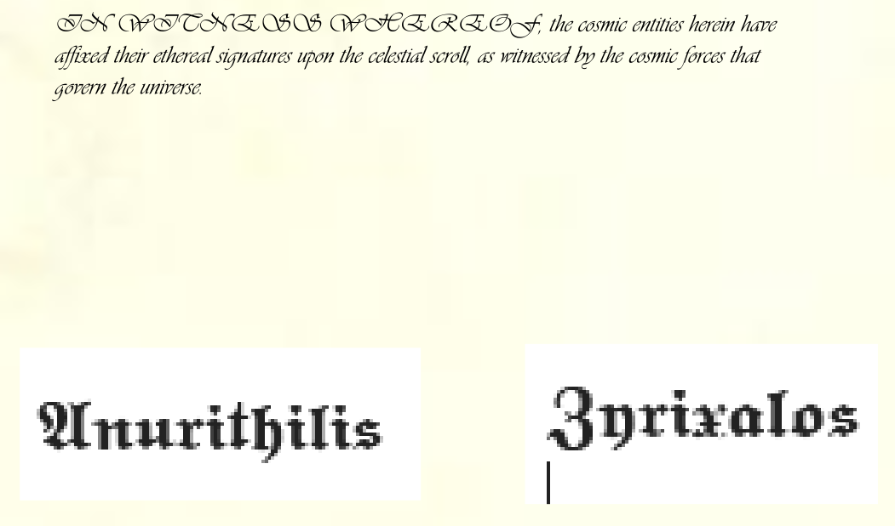
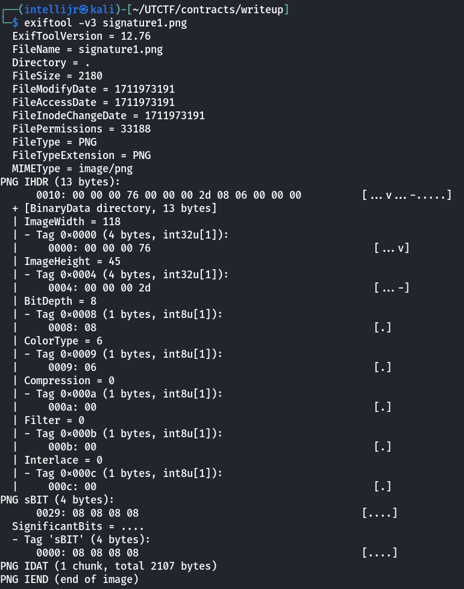
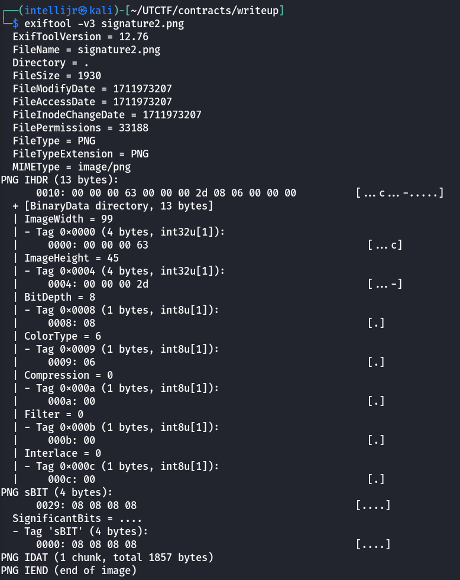
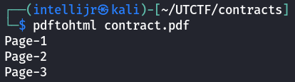
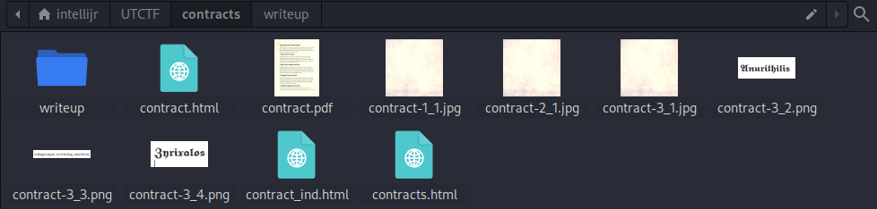
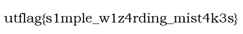

- Solves: 387
- Points: 100
## Description
Magical contracts are hard. Occasionally, you sign with the flag instead of your name. It happens.
## Contents
- [contract.pdf](media/contracts/contract.pdf) - appears to be some fictional contract between two parties. 
## Methodology
At the end of the PDF, we can see two signatures:
  

Upon right-clicking on them in the PDF, we can see that they are actually images:
  

Let's save both signatures as images, and examine them using `exiftool`.
  
  
That doesn't yield anything useful, which means the flag is not hidden inside the signatures, but somewhere else.

A tool called `pdftohtml` allows us to break down the PDF into all its constituent parts:
  
Let's examine the directory now:
  
We can see a new image that we haven't been able to see before - `contract-3_3.png`. Let's take a closer look:
  
And indeed, it turns out to be the flag!
