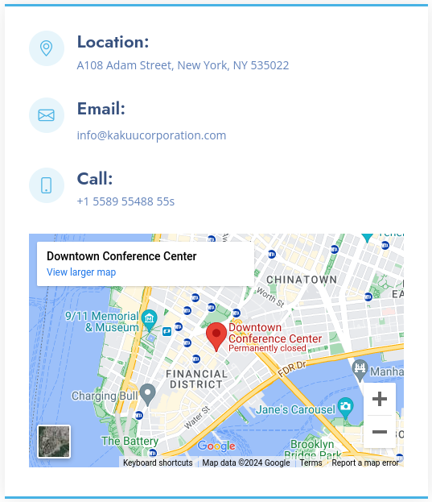
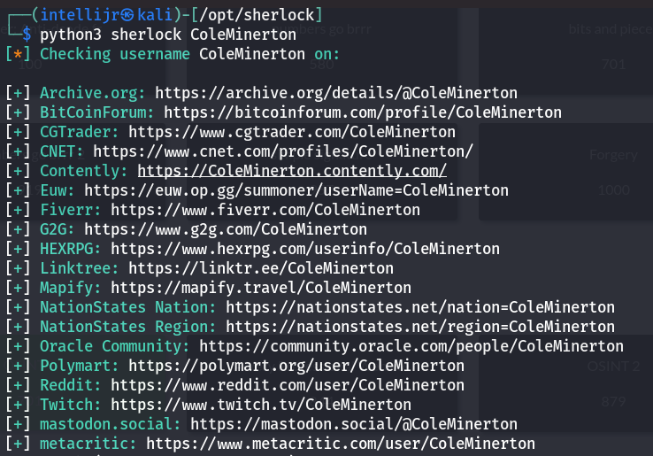
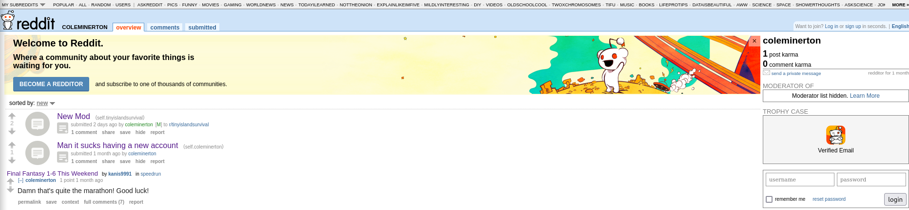
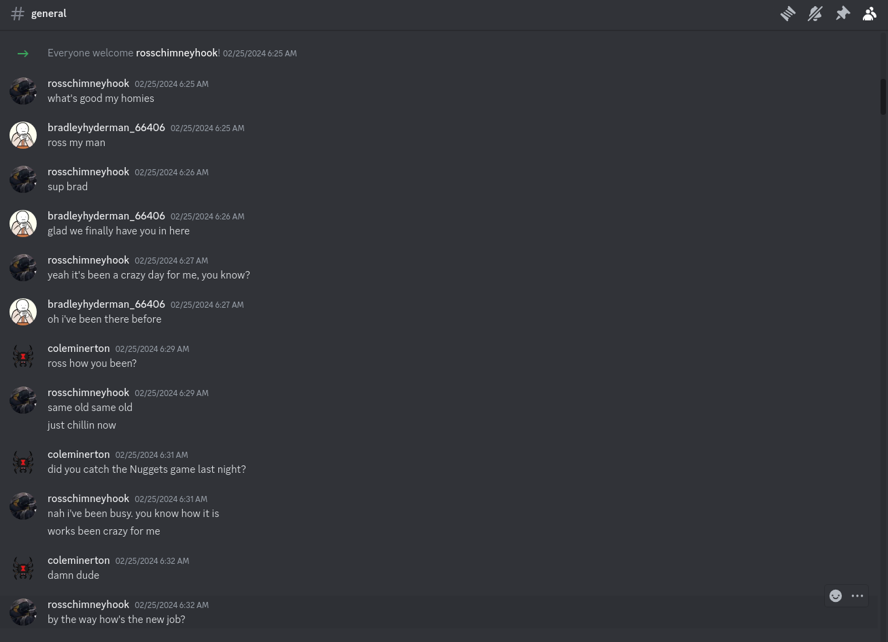

This write-up is split into 3 parts: OSINT 1, OSINT 2, and OSINT 3.
# OSINT 1
- Solves: 202
- Points: 572
## Description
It seems like companies have document leaks all the time nowadays. I wonder if this company has any.

(NOTE: It turns out there's also an actual company named Kakuu in Japan. The real company is not in scope. Please don't try and hack them.)
[http://puffer.utctf.live:8756](http://puffer.utctf.live:8756)
#### Hints
- You're looking for a leaked document. You won't find it on their website.
- Accounts online associated with the scenario should be (fairly) distinguishable.
## Methodology
Let's take a look at the website. The two main interest points we can find are the employees and the contact information.

The search on the location, email, and phone number tells us that this particular set of details is auto-generated by Bootstrap, a web development framework:
- https://news.ycombinator.com/item?id=30012178 - proof that the address is not real
- https://www.streameufunds.com/contact/ - another (random) website that uses Bootstrap. The address is the same, and the email is very similar.
- Searching for phone reveals a bunch of Bootstrap websites with that number, meaning it can't possibly be real.

The 2nd hint says there may be accounts on the internet associated with the employees. A Python tool named [`Sherlock`](https://github.com/sherlock-project/sherlock) can scan the internet for social media accounts given a username. It would make sense for Cole Minerton to be our first victim since the website says he was involved in "managing the company's social media presence".
  

We start checking every single website. The first one that gives us any further clues is [Linktree](https://linktr.ee/ColeMinerton).

#### [Twitter](https://twitter.com/coleminerton)
This is the only post on this account. Nothing else here, let's move on to Reddit.  

#### [Reddit](https://old.reddit.com/user/coleminerton)

Reddit seems more interesting. We can see that Cole's account is new, and also that he is a moderator on r/tinyislandsurvival subreddit. We'll come back to it later.
#### [YouTube](https://www.youtube.com/@ColeMinerton)
  

We can see a Discord link in the channel description and a video. Let's check the video first.

  

The video turns out to be just a normal speedrun with nothing suspicious in it. Looking at the description and the comments reveals nothing useful. 

Let's check the link now.

  

The link leads to a Discord server with 3 people in it: `coleminerton`, `rosschimneyhook`, and `bradleyhyderman_66406`. Let's check if there are any files here:  

  

There are a couple pictures, and a document named [`trustly_contract.pdf`](media/osint/trustly_contract.pdf). Let's check it.

We can finally see the flag, `utflag{discord_is_my_favorite_document_leaking_service}`, on the first line of the second paragraph.
# OSINT 2
- Solves: 141
- Points: 781
## Description
Can you find where the person you identified in the first challenge lives? Flag format is City,State,Zip. For example, if they live at UT Austin submit Austin,TX,78712.

Do not include any spaces in your submission. The submission is also case sensitive, and works with or without utflag{}.
#### Hints
- Follow the storyline.
- All in scope accounts follow the same naming convention. Once you've reached a centralized location any sites you need can be reached in at most 3 clicks.
## Methodology
Since we haven't taken a look at the Mastodon account in the first part, let's do it now.
## [Mastodon](https://mastodon.social/@coleminerton)
We can find out a few really important things from the posts on this account.
Firstly, we can confirm the Cole's affinity to Kakuu Corporation:

![[Pasted image 20240402002609.png]]

Secondly, we can see that Cole was about to go on a vacation:

![[Pasted image 20240402002851.png]]

Furthermore, we can see Cole visited a place called Angel Fire:

![[Pasted image 20240402003106.png]]

He also mentioned he's planning to go there again the next day, and he does. This appears to be just a casual trip for him, so there is a chance this place is close to where he lives. 

![[Pasted image 20240402003403.png]]

So where is this Angel Fire place, exactly? Let's do a search.

![[Pasted image 20240402003559.png]]

It's a village in the New Mexico state, and it's also a ski resort, just like we expected.
Lastly, we can see a post with an image that was taken just before he left for his vacation.

![[Pasted image 20240402004121.png]]

Let's take a closer look at the image. 

![[fc8c74d890cd6db9.jpg]]

We can see a few important things here: the name of the company at whose gas station Cole stopped, an ad poster, and a street sign.

The station is owned by Bradley. Doing a Google search on them tells us they were bought by another company named Stinker Stores in 2017: https://www.petrolplaza.com/news/6540. We can also find out they had 40 locations across several states, including New Mexico. However, trying to find the exact store locations has yielded no (quick) results.

On the poster, we can see the state of New Mexico being mentioned. At this point, we should have no doubts about the state where Cole lives in - New Mexico. Now, we only need to find out the city and the zip code.

![[Pasted image 20240402005302.png]]

The street sign says "Cimarron Ave".

![[Pasted image 20240402005615.png]]

Let's go to Google Maps and search for "Cimarron Ave NM".

![[Pasted image 20240402005922.png]]

Now, this is where my solution falls short of perfect. According to a UTCTF admin, by using all the hints available, it was possible to narrow the list down to a single location. However, I was not able to do that, so I had to try and submit all the possible locations. The correct city turned out to be Raton, which had only one zip code.
Flag: `Raton,NM,87740`.
# OSINT 3
- Solves: 96
- Points: 890
## Description
Can you find the person's IP address? Flag format is XXX.XXX.XXX.XXX
#### Hints
- If you wound up on another (unrelated) discord server, then one of the sites you visited is too new.
- All in scope accounts follow the same naming convention. Once you've reached a centralized location any sites you need can be reached in at most 3 clicks.
## Methodology
There is no reliable way of getting an IP address by using just someone's location ~~and I definitely did not spend 2 hours trying to do that for some reason~~, so we have to use a different method to obtain it. Let's come back to the Reddit account. 

- check out subreddit
- wiki link
- also show it on new reddit, now there's a different link there
- that's what the first hint means
- check out wiki
- go to history
- cole's name pops up
- go through edits
- fake ip
- "was not logged in for last edit", the ip of author in the prior edit is the Cole's IP.

# Methodology analysis
A few hours at the beginning of OSINT 1 were wasted doing Google searches on the employees, which yielded no results. That is not to say that the idea was wrong - I simply was not aware of Sherlock's existence, and discovering it was just a part of the learning process.

There was some confusion at the end of OSINT 3 because of the flag format given, which made it look like all 4 parts of the correct IP address had to be 3 digits long.  