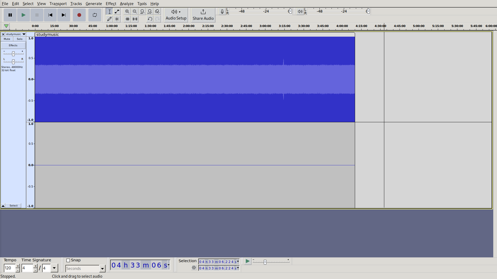
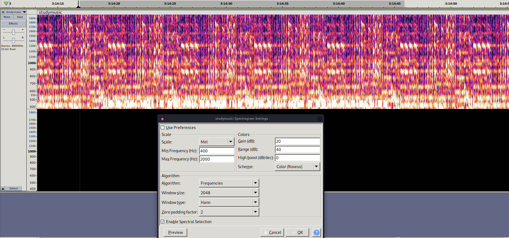
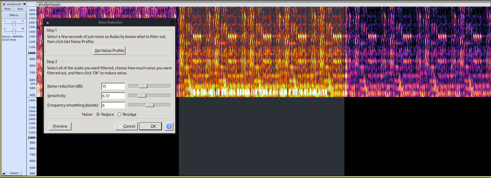
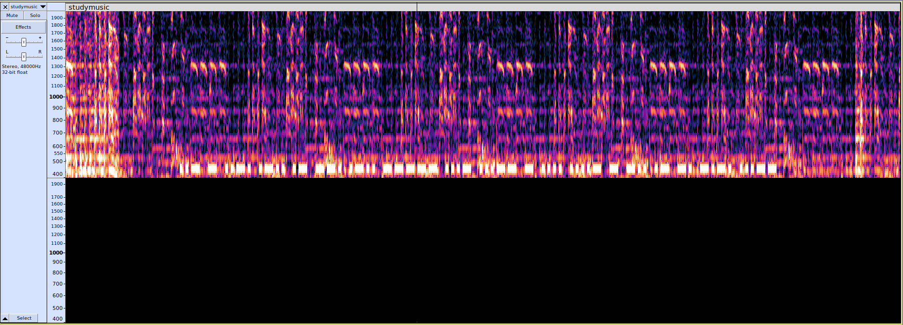
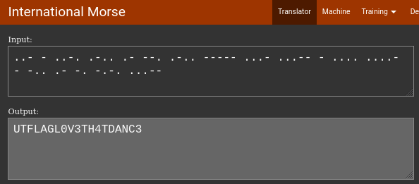

- Solves: 122
- Points: 834
## Description
I listen to this while studying for my exams. [https://youtu.be/1Cbaa6dO2Yk](https://youtu.be/1Cbaa6dO2Yk)

Note: the audio is the focus of this challenge. The video can be safely ignored.
## Methodology
Let's follow the YouTube link. 

The description says "it feels like it is trying to tell me something if I listen long enough, but no one has time for that". We don't have time for this either, so we silently nod in agreement and decide not to watch the whole video.
After desperately trying to find a way to download the audio (most YouTube to mp3 websites have a video length limit that does not even exceed 2 hours, let alone 10), we found [this website](https://tuberipper.com/21/save/mp3), and downloaded the video in .wav format.

Now, let's open it in Audacity:
  

Apart from being disappointed that our download actually got timed out, we can see that a part of the audio at around 3:14:00 stands out from the rest, so we decide to investigate. And indeed, we are able to hear a message encoded in Morse code.  
After applying some spectrogram settings...

...and some noise reduction...

...the pattern becomes more apparent.

Translating the Morse code to text gives us the flag:

